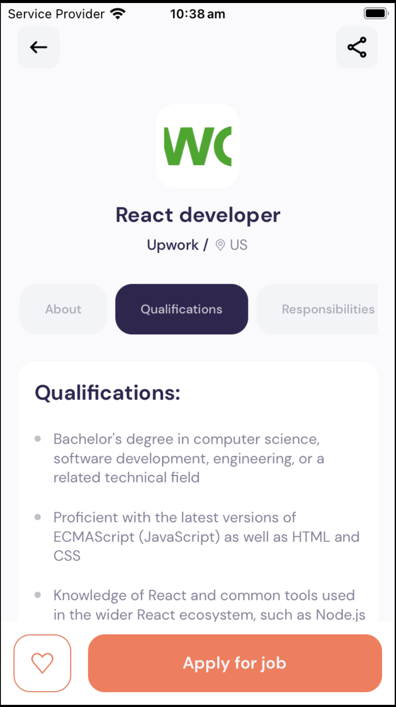
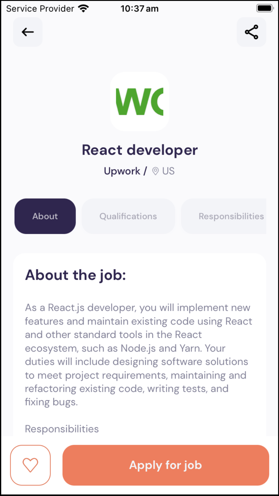
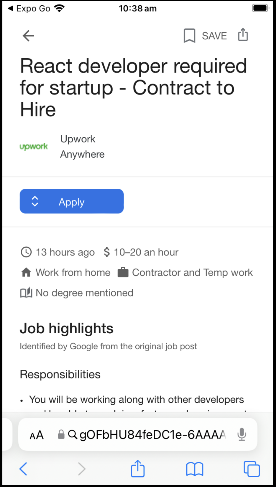

This project is a mobile job-finding app that was created using React native tutorials from YouTube, in preparation for my Front-end development internship with Fortus. The tech stack includes: React native, react, and expo router and was written fully in Javascript with some components written in HTML. 

The app has a live updated feed of nearby and popular jobs, which is retrieved using an AIP from RapidAPI. Users are also able to click on the jobs to get further information regarding the job role and responsibilities. At the bottom of the page, users are also apply to click the apply button to get rerouted to an application site. 

